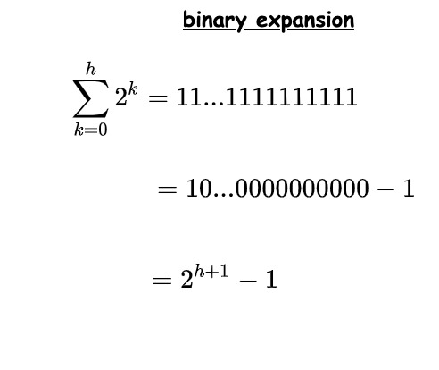
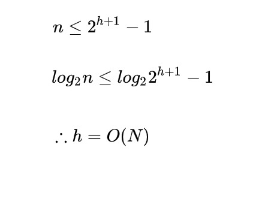
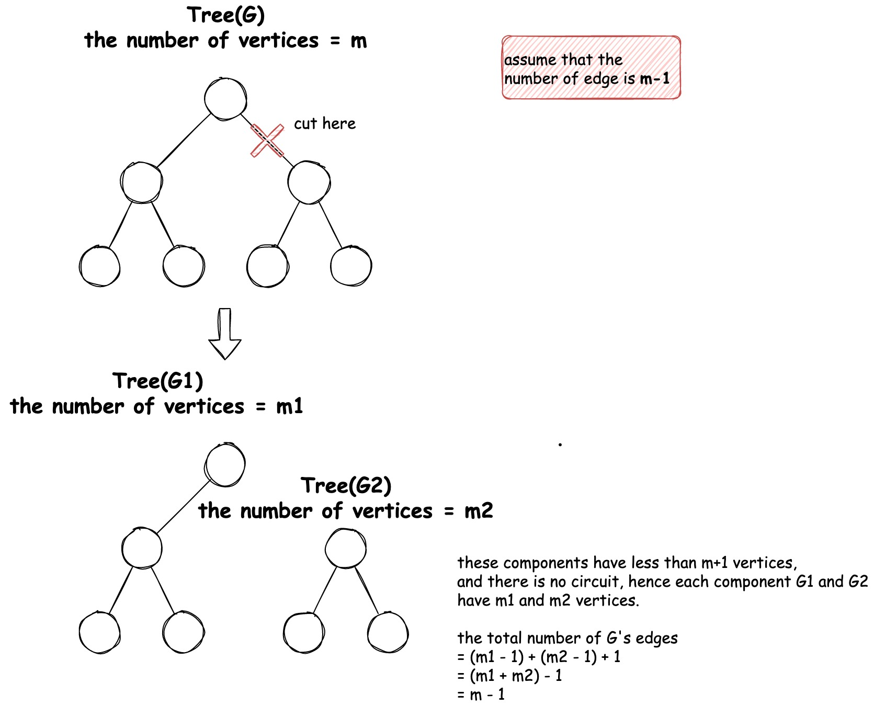

# 10-1

```
頂点数がNの二分木において，高さがN－1となるような例を挙げてください．（難易度★☆☆☆☆）
```

e.g. each nodes have only 1 child, the height of the tree gonna be N-1.

# 10.4

```
強平衡二分木の高さがh＝O(logN)となることを示してください．
```

the self-balancing binary search tree contains more than `Σ2^h(n:0->h)` nodes.

`Σ2^h(n:0->h)` can be transformed into 2^h+1 - 1.



from above, the height of the self-balancing binary tree is:



```
頂点数がNの木の辺数がN-1であることを示せ．
```

Let n be the number of vertices in a Tree `T`

- the number of edges = 0 if n = 1
- the number of edges = 1 if n = 2
- the number of edges = 2 if n = 3

Hence the statement is true for n = 1,2,3.

Let the statement be true for n = m.

