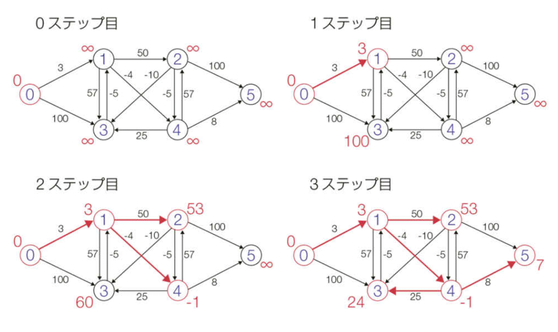
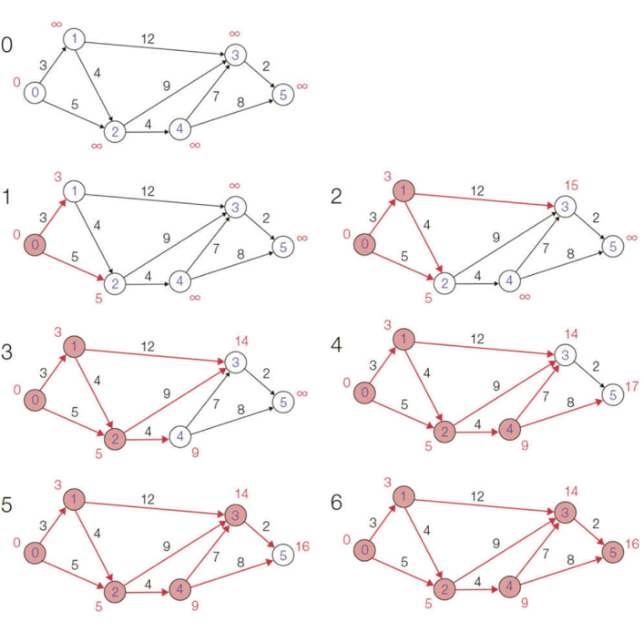
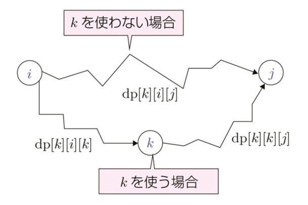
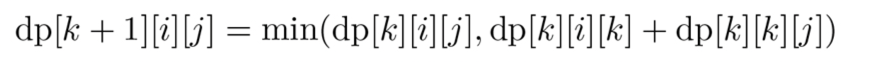

# 最短路問題

## bellman-ford

### 概要

N個のノードについて、それぞれのノードから到達可能な経路を操作し、
relaxを試みる。
この操作をN回繰り返し、依然としてrelaxが発生する場合は負閉路が存在する。

### 参考

https://github.com/drken1215/book_algorithm_solution/blob/master/codes/chap14/code_14_2.cpp

### 計算量

`O(|E||V|)`

### 証明

負閉路が存在するとき、|V|回目の反復時に必ず更新が発生することの証明:

algorithm introductionの P655.

## Dijkstra

### 概要

全てのpathが非負の時に可能。
到達コストが最も低いところから到達できるノードをrelaxし、そのノードを確定させる処理を繰り返す。

### 参考

https://github.com/drken1215/book_algorithm_solution/blob/master/codes/chap14/code_14_3.cpp
https://github.com/drken1215/book_algorithm_solution/blob/master/codes/chap14/code_14_4.cpp

### 計算量

- `O(|V|^2)`
- ヒープを使うと `O(|E|log|V|)` 

密グラフ |E| = Θ(|V|^2) の時は前者、後者の時はヒープを使うと良い。

## Floyd–Warshall

### 概要

全ての頂点に対して最短路を求める時に使う。
DPテーブル: dp[k][i][j]: 頂点0,1,...k のみを使って到達できる i->j への最短路超
を定義して、k,i,j を |V^3| で三重ループする。

relaxの様子:

### 参考

https://github.com/drken1215/book_algorithm_solution/blob/master/codes/chap14/code_14_5.cpp

### 計算量

- `O(|V^3|)`

